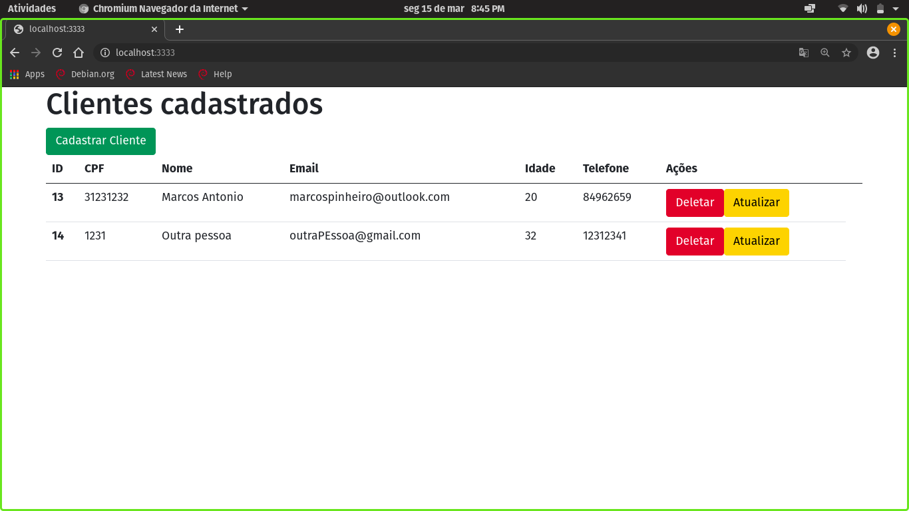
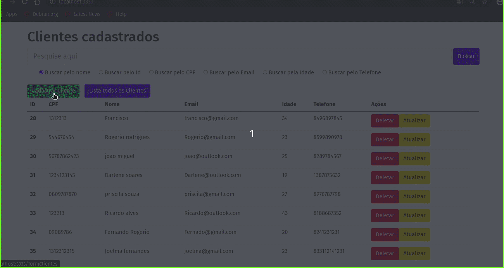
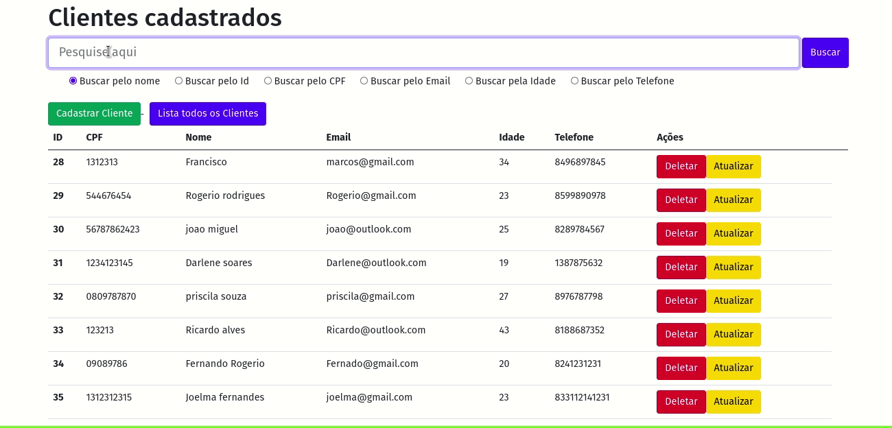

# Crud de clientes

Crud realizado para fins de estudo do framework AdonisJs

## Instalação 
  1. npm i -g @adonisjs/cli 
  2. npm i 
  3. adonis migration:run
  4. adonis serve --dev (run server)

## Funcionalidade 
  - [x] Cadastro de clientes
  - [x] Atualização de clientes
  - [x] Exclusão de clientes
  - [x] Mostrar clientes
 
 ## Preview 
 

  <h1> Home da Aplicação </h1>
  
  <h1>Cadastro</h1>
  
   <h1>Busca</h1>
  

### 🛠 Tecnologias

As seguintes ferramentas foram usadas na construção do projeto:
  - Adonis js
  - bootstrap4
